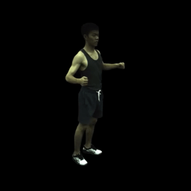
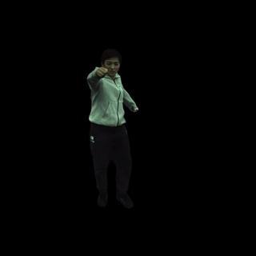
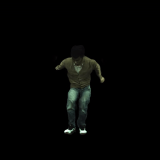
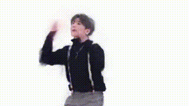

# MonoHuman: Animatable Human Neural Field from Monocular Video (CVPR 2023)


**MonoHuman: Animatable Human Neural Field from Monocular Video**<br>
[Zhengming Yu](https://yzmblog.github.io/),
[Wei Cheng](#),
[Xian Liu](https://alvinliu0.github.io/),
[Wayne Wu](https://wywu.github.io/),
and [Kwan-Yee Lin](https://kwanyeelin.github.io/)
<br>
**[Demo Video](https://www.youtube.com/watch?v=T91fXw9dOmM)** | **[Project Page](https://yzmblog.github.io/projects/MonoHuman)**
| **[Paper](https://arxiv.org/abs/2304.02001)**

This is an official implementation of MonoHuman using [PyTorch](https://pytorch.org/)

>Animating virtual avatars with free-view control is crucial for various applications like virtual reality and digital entertainment. Previous studies attempt to utilize the representation power of neural radiance field (NeRF) to reconstruct the human body from monocular videos. Recent works propose to graft a deformation network into the NeRF to further model the dynamics of the human neural field for animating vivid human motions. However, such pipelines either rely on pose-dependent representations or fall short of motion coherency due to frame-independent optimization, making it difficult to generalize to unseen pose sequences realistically. In this paper, we propose a novel framework **MonoHuman**, which robustly renders view-consistent and high-fidelity avatars under arbitrary novel poses. Our key insight is to model the deformation field with bi-directional constraints and explicitly leverage the off-the-peg keyframe information to reason the feature correlations for coherent results. In particular, we first propose a Shared Bidirectional Deformation module, which creates a pose-independent generalizable deformation field by disentangling backward and forward deformation correspondences into shared skeletal motion weight and separate non-rigid motions. Then, we devise a Forward Correspondence Search module, which queries the correspondence feature of keyframes to guide the rendering network. The rendered results are thus multi-view consistent with high fidelity, even under challenging novel pose settings. Extensive experiments demonstrate the superiority of proposed MonoHuman over state-of-the-art methods.


## Installation

We recommend to use [Anaconda](https://www.anaconda.com/).

Create and activate a virtual environment.

    conda env create -f environment.yaml
    conda activate Monohuman

### `Download SMPL model`

Download the gender neutral SMPL model from [here](https://smplify.is.tue.mpg.de/), and unpack **mpips_smplify_public_v2.zip**.

Copy the smpl model.

    cp /path/to/smpl/smplify_public/code/models/basicModel_neutral_lbs_10_207_0_v1.0.0.pkl third_parties/smpl/models

Follow [this page](https://github.com/vchoutas/smplx/tree/master/tools) to remove Chumpy objects from the SMPL model.

### `Download Pretrained model`
Download the pretrained model from [here](https://drive.google.com/drive/folders/1qLB9rNk703UxfQ80mccEs7EC9SK9c0KN?usp=drive_link)

## Run on ZJU-Mocap Dataset

### `Prepare a dataset`

1. Download ZJU-Mocap dataset from [here](https://github.com/zju3dv/neuralbody/blob/master/INSTALL.md#zju-mocap-dataset). 

2. Modify the yaml file of subject at `tools/prepare_zju_mocap/377.yaml` as below:
```
    dataset:
        zju_mocap_path: /path/to/zju_mocap
        subject: '377'
        sex: 'neutral'

...
```
3. Run the data preprocessing script.
```
    cd tools/prepare_zju_mocap
    python prepare_dataset.py --cfg 377.yaml
    cd ../../
```

4. Modify the 'dataset_path' in core/data/dataset_args.py to your /path/to/dataset

### `Training`

    python train.py --cfg configs/monohuman/zju_mocap/377/377.yaml resume False

DDP Training:

    python -m torch.distributed.launch --nproc_per_node 4 train.py --cfg configs/monohuman/zju_mocap/377/377.yaml --ddp resume False


### `Rendering and Evalutaion`

Render the motion sequence. (e.g., subject 377)

    python run.py \
        --type movement \
        --cfg configs/monohuman/zju_mocap/377/377.yaml 



Render free-viewpoint images on a particular frame (e.g., subject 387 and frame 100).

    python run.py \
        --type freeview \
        --cfg configs/monohuman/zju_mocap/387/387.yaml \
        freeview.frame_idx 100


Render the text driven motion sequence.
Generate poses sequence from [MDM](https://github.com/GuyTevet/motion-diffusion-model), and put the sequence to `path/to/pose_sequence/sequence.npy` (e.g., subject 394 and backflip)

    python run.py \
        --type text \
        --cfg configs/monohuman/zju_mocap/394/394.yaml \
        text.pose_path path/to/pose_sequence/backflip.npy


## Run on In-the-wild video

### `Prepare a dataset`
You can use [PARE](https://github.com/mkocabas/PARE) to get the SMPL annotations and use [RVM](https://github.com/PeterL1n/RobustVideoMatting) to get the masks.

Then put the results in the dataset path like following:

```
dataset_path
    ├── images
    │   └── ${item_id}.png
    ├── masks
    │   └── ${item_id}.png
    └── pare
        └── ${item_id}.pkl
```

Run the data preprocessing script.
```
    cd tools/prepare_wild
    python process_pare.py --dataset_path path/to/dataset
    python prepare_dataset.py --dataset_path path/to/dataset
    python select_keyframe.py --angle_threahold 30 --dataset_path path/to/dataset
    
    Then modified index_a and index_b in yaml file according to the output of select_keyframe.py.
```

Training is the same as ZJU_Mocap dataset.

### `Rendering`
The following is a rendering output example(We randomly collect a video from internet).

    python run.py \
        --type freeview \
        --cfg configs/monohuman/wild/wild.yaml \


## Acknowledgement

Our code took reference from [HumanNeRF](https://github.com/chungyiweng/humannerf), [IBRNet](https://github.com/googleinterns/IBRNet), [Neural Body](https://github.com/zju3dv/neuralbody). We thank these authors for their great works and open-source contribution.

## TODO
- [x] Code Release.
- [x] Demo Video Release.
- [x] Paper Release.
- [x] DDP Training.
- [x] Pretrained Model Release.


<a name="citation"></a>
## Citation
If you find this work useful for your research, please consider citing our paper: 

```bibtex
@inproceedings{yu2023monohuman,
  title={{MonoHuman}: Animatable Human Neural Field from Monocular Video},
  author={Yu, Zhengming and Cheng, Wei and Liu, xian and Wu, Wayne and Lin, Kwan-Yee},
  booktitle={CVPR},
  year={2023}
}
```

